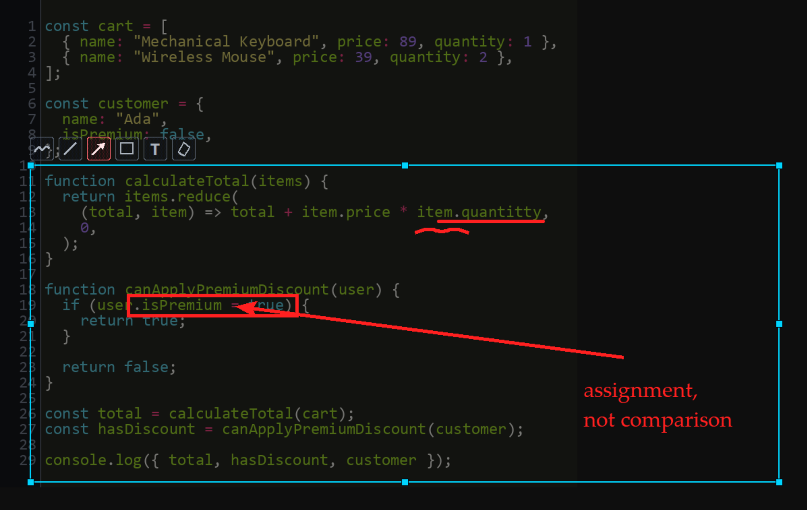

# Infershot

Infershot is a lightweight Windows screenshot tool for fast capture and visual QA.
It runs in the background, saves numbered screenshots, copies them to the clipboard,
and adds straight red lines or arrows before saving a selected region.



## Features

- Rectangle capture across the Windows virtual desktop
- Full-monitor capture for the monitor under the cursor
- Movable and resizable selection rectangle
- Floating translucent buttons for freehand, line, arrow, rectangle, text, and eraser tools
- Two-click red line and arrow annotations
- Automatic numbered filenames
- Optional clipboard copy
- Configurable capture, annotation, save, and cancel hotkeys

## Requirements

- Windows 10 or Windows 11
- Python 3.9 or newer
- [Pillow](https://pypi.org/project/pillow/)
- Tkinter, normally included with the standard Windows Python installer

The global PrintScreen hook and clipboard integration use Windows APIs, so the
application is not cross-platform.

## Installation

```powershell
git clone https://github.com/inferixon/infertools-infershot.git
cd infertools-infershot
python -m pip install -r requirements.txt
```

Review `config.json`, then launch:

```powershell
.\run-infershot.bat
```

Stop the background process with:

```powershell
.\stop-infershot.ps1
```

## Default hotkeys

| Action | Hotkey |
| --- | --- |
| Select a rectangle | `PrintScreen` |
| Capture the monitor under the cursor | `Ctrl+PrintScreen` |
| Start a red line | `Ctrl+LeftMouse` |
| Finish the active line | `LeftMouse` |
| Start a red arrow | `Ctrl+RightMouse` |
| Finish the active arrow | `RightMouse` |
| Save the selected capture | `Enter` |
| Cancel the pending annotation or capture | `Escape` |

For a rectangle capture, drag with the left mouse button. Before adding an
annotation, the selection can be moved from its interior or resized with its handles.
The second arrow click marks the arrow tip. Completed annotations are included in
both the saved image and the clipboard image. If a line or arrow has been started
but not finished, `Escape` removes only that pending annotation. With no pending
annotation, `Escape` cancels the capture.

After selecting a rectangle, use the floating buttons above its left edge. The
button group has no panel; each rounded button uses a faint border, a translucent
fill, wider spacing, and a subtle white hover glow. The tools appear in this order:

- Freehand – hold and drag the left mouse button.
- Line – click the start and end points.
- Arrow – click the start point, then the arrow tip.
- Rectangle – hold and drag the left mouse button to frame an area.
- Text – click inside the selection and type inside a transparent, border-only
  editor. `Enter` starts a new line, `Ctrl+Enter` commits the text, and `Escape`
  cancels the active text editor.
- Eraser – clear every completed or pending annotation without closing or changing
  the capture selection.

Click the active toolbar icon again to return to normal selection move mode.
Resize handles always remain available, including after annotations are added.

## Configuration

`config.json` is loaded when Infershot starts. Restart the application after edits.

```json
{
  "save_path": "C:\\SCREENSHOTS",
  "format": "jpg",
  "quality": 95,
  "filename_mask": "ScreenShot-{nnn}",
  "copy_to_clipboard": true,
  "text": {
    "font_family": "Palatino Linotype",
    "font_size": 24
  },
  "hotkeys": {
    "rectangle": "PrintScreen",
    "fullscreen": "Ctrl+PrintScreen",
    "line_start": "Ctrl+LeftMouse",
    "line_finish": "LeftMouse",
    "arrow_start": "Ctrl+RightMouse",
    "arrow_finish": "RightMouse",
    "save": "Enter",
    "cancel": "Escape"
  }
}
```

Supported selector combinations use `Ctrl`, `Shift`, or `Alt` with
`LeftMouse`, `RightMouse`, `Enter`, `Escape`, or a single keyboard character.
Capture shortcuts currently use PrintScreen with optional modifier keys.

If a config field is missing, the built-in default from `infershot.py` is used.
The default annotation font is Palatino Linotype at 24 px. Font size is clamped
to the supported range of 8–96 px.

## License

Infershot is released under the [MIT License](LICENSE). You may use, modify,
distribute, sublicense, or sell copies of the software while preserving the
license and copyright notice.
