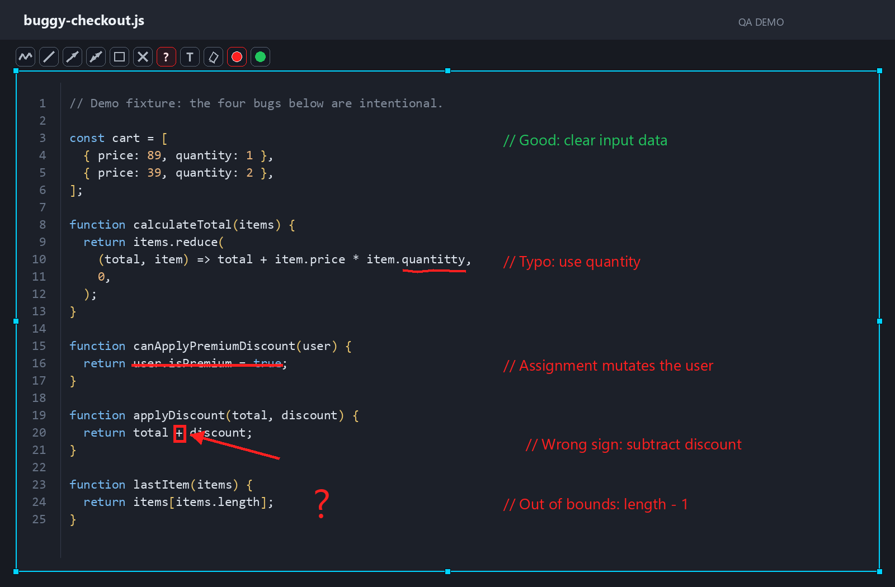

# Infershot

Infershot is a lightweight Windows screenshot tool for fast capture and visual QA.
It runs in the background, saves numbered screenshots, copies them to the clipboard,
and adds colored annotations before saving a selected region.



The demo uses an [intentional buggy code fixture](assets/demo/buggy-checkout.js).
`python assets/demo/generate.py all` builds the clean background, annotated image,
transparent selection-and-toolbar overlay, and final README image as separate files.
After UI-only changes, run `python assets/demo/generate.py ui` and then
`python assets/demo/generate.py final` without rebuilding the code or annotations.

## Features

- Rectangle capture across the Windows virtual desktop
- Full-monitor capture for the monitor under the cursor
- Movable and resizable selection rectangle
- Floating translucent buttons for freehand, line, arrow, double arrow, rectangle, cross, question mark, text, eraser, and configured colors
- DPI-matched text preview with a live keyboard layout and Caps Lock indicator
- Two-click line and arrow annotations in the selected color
- Automatic numbered filenames
- Optional clipboard copy
- Configurable capture, annotation, save, and cancel hotkeys

## Requirements

- Windows 10 or Windows 11
- Python 3.9 or newer
- [Pillow](https://pypi.org/project/pillow/)
- Tkinter, normally included with the standard Windows Python installer

The global PrintScreen hook and clipboard integration use Windows APIs, so the
application is not cross-platform.

## Installation

```powershell
git clone https://github.com/inferixon/infertools-infershot.git
cd infertools-infershot
python -m pip install -r requirements.txt
```

Review `config.json`, then launch:

```powershell
.\run-infershot.bat
```

Stop the background process with:

```powershell
.\stop-infershot.ps1
```

## Default hotkeys

| Action | Hotkey |
| --- | --- |
| Select a rectangle | `PrintScreen` |
| Capture the monitor under the cursor | `Ctrl+PrintScreen` |
| Start a line | `Ctrl+LeftMouse` |
| Finish the active line | `LeftMouse` |
| Start an arrow | `Ctrl+RightMouse` |
| Finish the active arrow | `RightMouse` |
| Undo the last annotation action | `Ctrl+Z` |
| Save the selected capture | `Enter` |
| Cancel the pending annotation or capture | `Escape` |

For a rectangle capture, drag with the left mouse button. Before adding an
annotation, the selection can be moved from its interior or resized with its handles.
The second arrow click marks the arrow tip. Completed annotations are included in
both the saved image and the clipboard image. If a line or arrow has been started
but not finished, `Escape` removes only that pending annotation. With no pending
annotation, `Escape` cancels the capture.

After selecting a rectangle, use the floating buttons above its left edge. The
button group has no panel; each rounded button uses a faint border, a translucent
fill, wider spacing, and a subtle white hover glow. The tools appear in this order:

- Freehand – hold and drag the left mouse button.
- Line – click the start and end points.
- Arrow – click the start point, then the arrow tip.
- Double arrow – click the two endpoints to add arrowheads at both ends.
- Rectangle – hold and drag the left mouse button to frame an area.
- Cross – click once for the configured size, or hold and drag to resize X.
- Question mark – click once for the configured size, or hold and drag to resize `?`.
- Text – click inside the selection for the configured font size, or hold and
  drag a text frame to set its size. Typing expands the transparent, border-only
  frame as needed. A compact status shows the active `EN`, `NO`, or `UA` layout
  and Caps Lock state. `Enter` starts a new line, `Ctrl+Enter` commits the text,
  and `Escape` cancels the active text editor.
- Eraser – clear every completed or pending annotation without closing or changing
  the capture selection.
- Color circles – select the color for subsequent annotations. They follow the
  tool buttons in the order listed in `colors`; the count matches that list.

`Ctrl+Z` removes the latest completed annotation. If Eraser cleared the canvas,
`Ctrl+Z` restores the annotations it removed. The undo buffer keeps the latest
`undo_limit` states (20 by default).

Click the active toolbar icon again to return to normal selection move mode.
Resize handles always remain available, including after annotations are added.

## Configuration

`config.json` is reloaded on every `PrintScreen` invocation, so edits apply without restarting Infershot.

```json
{
  "save_path": "C:\\SCREENSHOTS",
  "format": "jpg",
  "quality": 95,
  "filename_mask": "ScreenShot-{nnn}",
  "copy_to_clipboard": true,
  "undo_limit": 20,
  "colors": ["#ff2020", "#22c55e"],
  "text": {
    "font_family": "Palatino Linotype",
    "font_size": 24
  },
  "cross": {
    "size": 48
  },
  "question": {
    "size": 48
  },
  "hotkeys": {
    "rectangle": "PrintScreen",
    "fullscreen": "Ctrl+PrintScreen",
    "line_start": "Ctrl+LeftMouse",
    "line_finish": "LeftMouse",
    "arrow_start": "Ctrl+RightMouse",
    "arrow_finish": "RightMouse",
    "save": "Enter",
    "undo": "Ctrl+Z",
    "cancel": "Escape"
  }
}
```

Supported selector combinations use `Ctrl`, `Shift`, or `Alt` with
`LeftMouse`, `RightMouse`, `Enter`, `Escape`, or a single keyboard character.
Capture shortcuts currently use PrintScreen with optional modifier keys.

If a config field is missing, the built-in default from `infershot.py` is used.
The default annotation font is Palatino Linotype at 24 points. Font size is
clamped to 8–96 points and DPI-matched in the saved image. Drag-sized text also
uses this range without changing the configured default. A short cross click
uses the configured 48 px default; hold and drag for a live size from 16–256 px.
The question mark has its own `question.size` default and uses the same drag
gesture. `colors` accepts `#RRGGBB` values in display order; an empty list hides
the color buttons and keeps the built-in red fallback. Each completed annotation
keeps its chosen color when another color is selected or an action is undone.

## License

Infershot is released under the [MIT License](LICENSE). You may use, modify,
distribute, sublicense, or sell copies of the software while preserving the
license and copyright notice.
